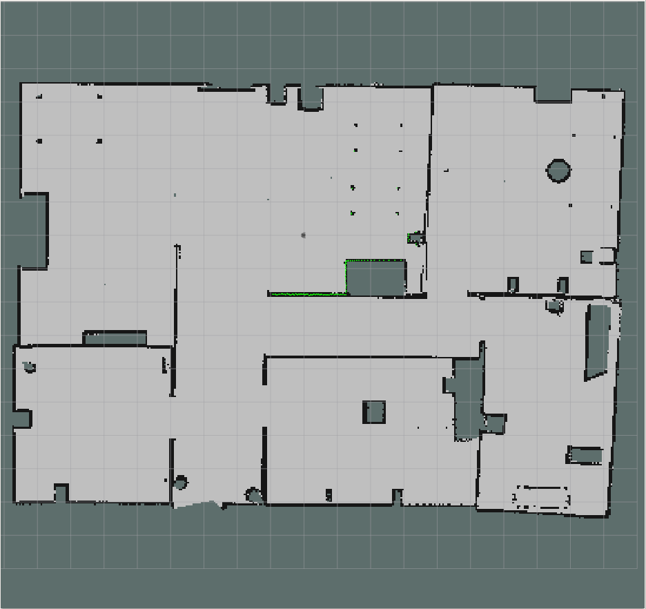
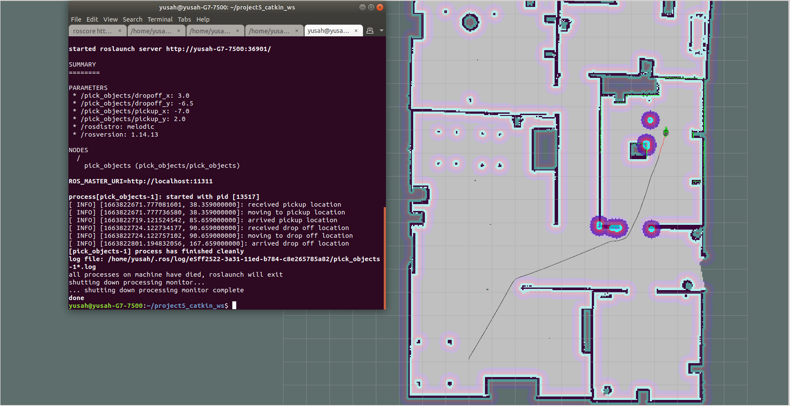
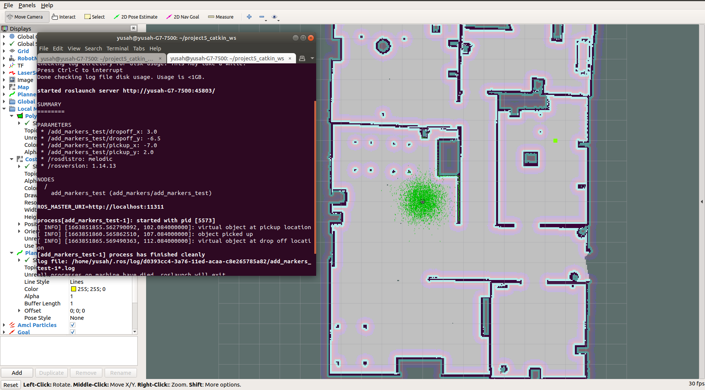

# Home Service Robot
This is the final project for the Udacity's Robotics Software Engineer Nanodegree. Its objective is to test the overall knowledge gained during the program, it therefore consists of the following pieces:
* Building a simulation world using Gazebo simulator,
* Robot localization using AMCL,
* Simultaneous Localization and Mapping (SLAM) using gmapping package,
* Motion planning using the ROS Navigation stack,
* Building robotic software using ROS features.

The above pieces are combined to simulate a home service robot capable of picking virtual objects from their pickup location and transporting them to a predefined drop-off location while simultaneously avoiding obstacles.

## Directory tree and packages
```
.
├── add_markers                                 # add_markers package
│   ├── launch
│   │   └── add_markers.launch
|   |   └── add_markers_test.launch
│   └── src
│   |   ├── add_markers.cpp
│   |   └── add_markers_test.cpp
|   └──  ... ...
├── images                                      # media files
|   └──  ... ...
├── pick_objects                                # pick objects package
│   ├── launch
│   │   └── pick_objects.launch
│   └── src
│   |   ├── pick_objects.cpp
|   └──  ... ...
├── scripts                                     # shell scripts files
│   ├── add_markers.sh
│   ├── home_service.sh
│   ├── pick_objects.sh
│   ├── test_navigation.sh
│   └── test_slam.sh
├── service_bot                                 # service bot package
│   ├── config                                  # navigation stack config files
|   |   ├── _MACOSX
|   |   |   └──  ... ...
|   │   ├── base_local_planner_params.yaml
|   │   ├── costmap_common_params.yaml
|   │   ├── global_costmap_params.yaml
|   │   └── local_costmap_params.yaml
│   ├── launch                                  # amcl launch file
│   │   └── amcl.launch
│   └── maps                                    # map files
│   |   ├── myMap.pgm
|   |   ├── myMap.yaml
|   |   └──  ... ...
|   └──  ... ...
├── slam_gmapping                               # gmapping package
│   ├── gmapping
|   |   ├── launch
|   |   |   └── slam_gmapping.launch 
|   │   └── ... ...   
│   └── ... ...
├── teleop_twist_keyboard                       # teleop twist keyboard
│   |── teleop_twist_keyboard.py
│   └── ... ...
├── turtlebot3                                  # turtlebot3
│   |── turtlebo3_description
|   |   ├── urdf
|   |   |   ├── turtlebot3_burger.urdf.xacro
|   |   |   └── ... ...
|   │   └── ... ...
│   |── turtlebo3_gazebo
|   │   ├── launch
|   |   |   ├── turtlebot3_world.launch
|   │   │   └── view_navigation.launch
|   │   └── worlds
|   │       ├── new_world.world
|   |       └── ... ...
│   └── turtlebo3_navigation
|       ├── rviz
|       |   └── turtlebot3_navigation.rviz
|       └── ... ...
└── README.md

```

## Prerequisites
* Ubuntu 18.04 or later,
* ROS melodic or later,
* Gazebo 9.0 or later,
* CMake and gcc/g++,
* Follow [this](http://wiki.ros.org/catkin/Tutorials/create_a_workspace) link to create a catkin workspace.

## Clone and Build
* Clone the repo within the src folder of your catkin workspace
    ```
    $ git clone https://github.com/yabdulra/Home_Service_Robot.git
    ```

* Change directory to `catkin_ws` and build.
    ```
    $ cd ..
    $ catkin_make
    ```

## Tasks
The shell scripts in the `scripts` directory provides a number of tasks that can be performed. What follows is a brief demo of how to perform each of these tasks using the scripts.

  * ### Test SLAM
    The test_slam script is launched using `./test_slam.sh` from the scripts directory. It launches files in the following order:  
    - `roslaunch turtlebot3_gazebo turtlebot3_world.launch` to launch the robot in the provided simulation world,  
    - `roslaunch gmapping slam_gmapping.launch` to launch to gmapping node,  
    - `roslaunch turtlebot3_gazebo view_navigation.launch` to launch rviz for map visualization,  
    - `rosrun teleop_twist_keyboard teleop_twist_keyboard.py` brings up a keyboard to maually control the robot.  
  
    Move the robot carefully using the teleop keyboard to build a complete map of the environment. Once the complete map is built, save it using `rosrun mapserver mapsaver -f <-map_name->` . The image below shows the map built by driving the robot in the environment.
    <p>
      </a>
    </p>
  
  * ### Test Navigation
    Test_navigation uses the map built by test_slam to launch amcl and the navigation stack. The `test_navigation.sh` script launches files in the following order:
    - `roslaunch turtlebot3_gazebo turtlebot3_world.launch` to launch the robot in the provided simulation world,
    - `roslaunch service_bot amcl.launch` to launch amcl and the navigation stack,
    - `roslaunch turtlebot3_gazebo view_navigation.launch` to launch rviz for map visualization.  

    Use the `2D Nav Goal` on the tools panel on RVIZ to send to navigation goals, one at a time to visualize the robot move to the set goal locations. A sample video(2.5 times speed) below shows the robot moving to the set goal locations.  

   <iframe id="video" width="560" height="315" src="https://www.youtube.com/watch?v=NZ7jPu-n5AY" frameborder="0" allow="autoplay; encrypted-media" allowfullscreen=""></iframe>

  
  * ### Pick Objects
    The `pick_objects.sh` builds on the `test_navigation.sh` script to launch a node that sends predefined goal poses (pickup and drop-off goals) to the robot to simulate the movement of the robot from initial pose to the pickup location, and finally to the drop-off location. The image below shows the steps taken by the robot to move from pickup location to the drop-off location.
    <p>
      </a>
    </p>
  
  * ### Add Markers
    The add_markers package creates virtual objects with markers in rviz. To test this functionality, add_markers_test.cpp node is used to publish objects on rviz at the pickup location. The object is picked after a 5s delay, and published at its final location after another 5s. `add_markers.sh` is used to launch the necessary packages to achieve this task. The figure below shows the virtual object (square-green marker) with actions displayed on the terminal.
    <p>
      </a>
    </p>

  * ### Home Service
    To integrate the pieces together and simulate a full home service robot, communication is eastablished between the add_markers node the pick_objects node. Virtual object is published at the pickup location which disappear (assumed to have been picked up) once the robot arrives the pickup location. The robot then moves to deliver the object which appears at the final goal as soon as the robot reaches the goal. `home_service.sh` is used to launch the necessary packages to simulate the home service robot. A sample video shows the robot delivering object from pickup to drop-off locations.

   <iframe id="video" width="560" height="315" src="https://www.youtube.com/watch?v=v96rTuizjFU" frameborder="0" allow="autoplay; encrypted-media" allowfullscreen=""></iframe>


